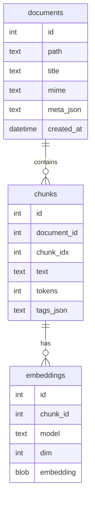

# raglite-sqlite

[](https://github.com/mmprotest/raglite-sqlite/actions/workflows/ci.yml)


[](https://pypi.org/project/raglite-sqlite/)

Local-first retrieval augmented generation toolkit built on SQLite. Raglite bundles
ingestion, chunking, hybrid BM25/vector search, Typer CLI workflows, and a FastAPI
microservice. Everything runs on CPU and stores state in a single SQLite database.

## Quickstart in 6 lines

```bash
python -m venv .venv && source .venv/bin/activate
pip install "raglite-sqlite[server]"
raglite init-db --db demo.db
raglite ingest --db demo.db --path demo/mini_corpus
raglite query --db demo.db --text "quick start guide" --k 5 --alpha 0.6
raglite serve --db demo.db --host 127.0.0.1 --port 8080
```

_On Windows use `\.venv\Scripts\activate` for step two._

## Installation

Raglite is published as [`raglite-sqlite` on PyPI](https://pypi.org/project/raglite-sqlite/). Install the
core toolkit with:

```bash
pip install raglite-sqlite
```

To enable the optional FastAPI server, install the `server` extra:

```bash
pip install "raglite-sqlite[server]"
```

Development dependencies (linters, type checkers, packaging utilities) can be installed
with the `dev` extra:

```bash
pip install "raglite-sqlite[dev]"
```

## Features

- Deterministic chunking and debug embeddings for air-gapped demos, with an easy upgrade
  path to SentenceTransformer models.
- Hybrid BM25 + cosine search with rerank option and automatic Python fallback when SQLite
  vector extensions are unavailable.
- Typer CLI (`raglite`), FastAPI server (`raglite serve`), and Python API for scripted use.
- Offline demo kit (`demo/mini_corpus`) with one-shot run scripts and proof artifacts.
- Tiny eval and benchmark scripts that run in seconds and provide reproducible metrics.

## Demo & proof artifacts

Explore the bundled two-minute corpus and scripts inside [`demo/`](demo/README.md):

- `demo/mini_corpus/`: 12 varied documents (how-to, FAQ, articles, product docs).
- `demo/run_demo.sh` / `demo/run_demo.ps1`: create a virtual environment, install Raglite,
  ingest the demo corpus, run a sample query, and start the FastAPI server with curl hints.
- `demo/eval_set.jsonl`: 25 ground-truth query snippets for offline evaluation.

A placeholder animation (`demo/demo.gif`) can be replaced with your own screenshots once
you run the scripts.

## CLI highlights

- `raglite self-test` builds a temporary database from the demo corpus, runs three canned
  queries, prints titles/snippets, reports the active vector backend, and dumps stats.
- `raglite stats` now returns document, chunk, embedding counts plus backend, embedding
  model/dimensions, FTS status, and alpha.
- `raglite benchmark` / `raglite eval` invoke the new tiny scripts under `scripts/`.

## Vector backends

Raglite automatically selects the most capable vector backend:

1. **SQLite extension** (`sqlite-vec` or `sqlite-vss`): if loadable, cosine similarity runs
   directly inside SQLite for best performance. Example load step:
   ```python
   import sqlite3
   conn = sqlite3.connect("raglite.db")
   conn.enable_load_extension(True)
   conn.load_extension("sqlite_vec")
   conn.enable_load_extension(False)
   ```
2. **Python fallback (default)**: BM25 prefilters the top 200 rows and cosine similarity is
   computed with NumPy arrays in Python. This works cross-platform with zero extra
   dependencies.
3. **None**: if the embeddings table is absent, vector search is skipped and BM25 answers
   requests alone.

`raglite self-test`, `raglite stats`, and the benchmark script print which path you are on.
Expect the Python fallback to be a few milliseconds slower per query but fully portable.

## Architecture



`chunk_fts` is a virtual FTS5 table kept in sync with the `chunks` table via insert/update
triggers; see [`src/raglite/schema.sql`](src/raglite/schema.sql) for details.

## Evaluations & benchmarks

- `python scripts/eval_small.py` compares BM25, Hybrid (α=0.6), and optional rerank on the
  bundled dataset. Hybrid matches BM25 on this micro-set by default and rerank (if
  installed) can further improve conversational queries.
- `python scripts/bench_basic.py` duplicates the demo corpus to ~2k chunks, reports indexing
  throughput, query latency (p50/p95) with and without vector fallback, database size, and
  backend selection.
- Both scripts support `--tiny` for <30s smoke runs and fall back to packaged data when
  installed from wheels.

> **Limitations & Guidance**
> - Designed for small/medium local corpora, not massive ANN workloads. For millions of
>   vectors, adopt a dedicated vector database.
> - Best with a single writer; readers work fine with WAL mode. Remember to back up both
>   `*.db` and `*.db-wal` files.
> - Increase α to ≥0.6 when keyword precision matters; lower it or enable rerank (with
>   `raglite-sqlite[rerank]`) for conversational questions.
> - Raglite is local-first—avoid ingesting secrets or PII. Use `.ragliteignore` patterns or
>   preprocess files to filter sensitive content.

## Tests & quality

Run the full suite that matches CI:

```bash
ruff check src tests
black --check src tests
mypy src
pytest -q
raglite self-test
```

## License

MIT
